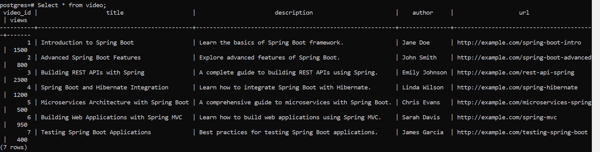
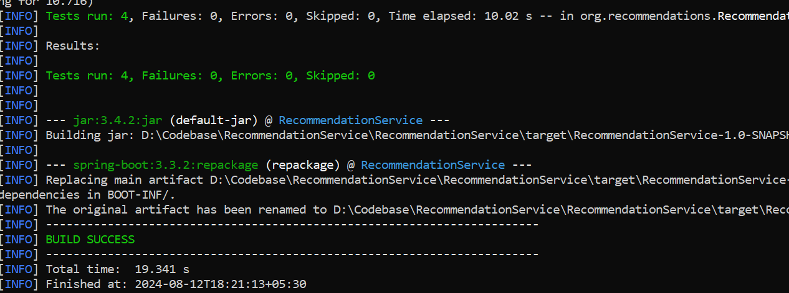
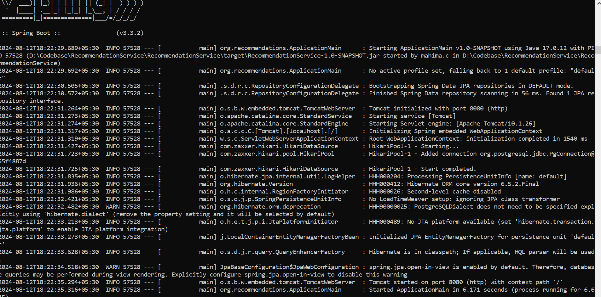
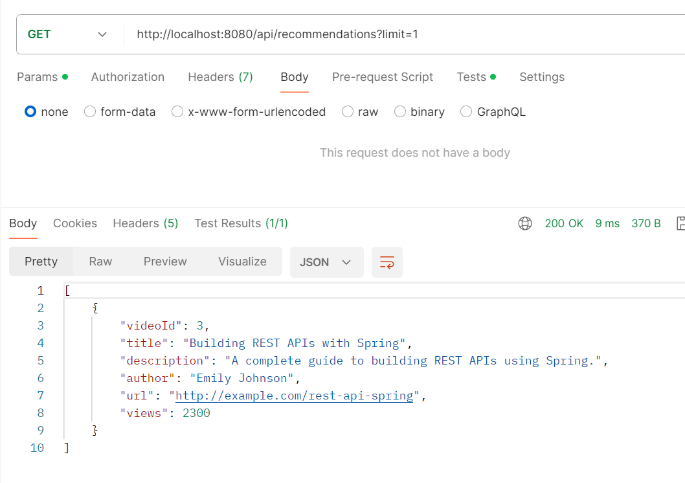

Prerequisites :
1. Install and setup the require applications. 
   1. Java 17 installed and setup
   2. PostgreSQL (14 version)
   3. Maven
2. Pre-Load the database with the set of videos.
   1. Execute the data.sql file in the resources to create table, indexes and insert the data. 
   2. Once you fetch the videos records data would look like this :

3. Build your application using mvn clean build
   
4. Deploy your application using RecommendationService-1.0-SNAPSHOT.jar
   
5. Use postman to hit your local application.
   
6. Please find the sample postman collection in the src/main/resources